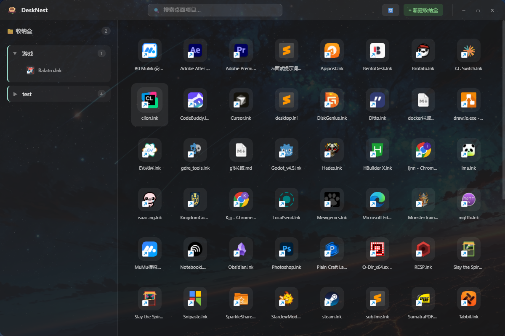

# DeskNest

<p align="center">
  
</p>

<p align="center">
  <b>轻量级 Windows 桌面整理工具</b>
</p>

<p align="center">
  <a href="#功能特性">功能特性</a> •
  <a href="#截图">截图</a> •
  <a href="#快速开始">快速开始</a> •
  <a href="#开发指南">开发指南</a> •
  <a href="#技术架构">技术架构</a> •
  <a href="#许可证">许可证</a>
</p>

---

## 简介

DeskNest 是一款为 Windows 设计的轻量级桌面整理工具。它采用**虚拟组织**理念——只在你眼中重新排列桌面图标，**绝不移动真实文件**。搭配真实的 Windows 图标提取、流畅的拖拽交互和现代感 UI，让你的桌面从此井井有条。

> 核心理念：**整理的是视图，不是文件。**

## 功能特性

- **自动扫描桌面** —— 启动即自动扫描当前用户桌面目录（支持 OneDrive 重定向）
- **真实图标提取** —— 通过 Windows API (`SHGetFileInfoW`) 提取应用原生图标，非静态图标映射
- **网格布局展示** —— 自适应网格，图标名称自动截断，悬停放大效果
- **虚拟收纳盒** —— 创建彩色分组，将图标拖入归类，退出后文件仍在原位
- **拖拽分组** —— 支持 HTML5 原生拖拽，将桌面图标拖入左侧收纳盒
- **双击打开** —— 单击选中，双击打开文件或启动应用（支持 `.lnk` 快捷方式解析）
- **实时搜索** —— 顶部搜索栏即时过滤桌面项目
- **分组持久化** —— 收纳盒配置自动保存，重启后自动恢复
- **现代 UI** —— 透明毛玻璃窗口、圆角边框、自定义标题栏，风格参考 Windows 11 / Raycast

## 截图

<p align="center">
  
</p>

## 快速开始

### 环境要求

- **Node.js** >= 20
- **Rust** >= 1.70
- **Windows** 10/11

### 安装依赖

```bash
# 克隆仓库
git clone https://github.com/ywz626/desknest.git
cd desknest

# 安装前端依赖
npm install

# 安装 Tauri CLI（如未全局安装）
npm install -g @tauri-apps/cli
```

### 开发模式

```bash
# 同时启动 Vite 前端和 Tauri 后端
npm run tauri dev
```

### 生产构建

```bash
# 构建前端 + Rust 后端，打包为 Windows 安装程序
npm run tauri build
```

构建产物位于 `src-tauri/target/release/bundle/`。

## 开发指南

### 项目结构

```
desknest/
├── src/                          # Vue 3 前端
│   ├── components/               # 组件
│   │   ├── AppShell.vue          # 应用外壳（标题栏、搜索、窗口控制）
│   │   ├── DesktopGrid.vue       # 桌面图标网格
│   │   ├── DesktopIcon.vue       # 单个桌面图标（单击选中、双击打开）
│   │   ├── DesktopItemIcon.vue   # 图标提取/渲染（支持 desktop/compact 双尺寸）
│   │   └── FolderGroupPanel.vue  # 左侧收纳盒面板
│   ├── stores/
│   │   └── desktop.ts            # Pinia Store（桌面状态、分组、持久化）
│   ├── types/
│   │   └── desktop.ts            # TypeScript 类型定义
│   └── App.vue                   # 根组件
├── src-tauri/                    # Tauri v2 + Rust 后端
│   ├── src/
│   │   ├── commands/             # Tauri IPC Commands
│   │   │   ├── scan.rs           # 扫描桌面目录
│   │   │   ├── icon.rs           # 提取文件图标（base64 PNG）
│   │   │   └── open.rs           # 打开文件/应用（ShellExecuteW）
│   │   ├── services/             # 业务服务层
│   │   │   ├── scanner.rs        # 桌面扫描逻辑（dirs::desktop_dir）
│   │   │   └── icon_extractor.rs # Windows 图标提取（GDI → PNG → base64）
│   │   ├── models/               # 数据模型
│   │   │   └── desktop_item.rs   # DesktopItem / FolderGroup 结构
│   │   └── lib.rs                # Tauri 应用入口
│   ├── icons/                    # 应用图标资源
│   └── tauri.conf.json           # Tauri 配置
├── screenshot.png                # 项目截图
└── package.json
```

### 常用命令

| 命令 | 说明 |
|------|------|
| `npm run dev` | 仅启动 Vite 前端开发服务器 |
| `npm run build` | 前端生产构建（含类型检查） |
| `npm run tauri dev` | 启动完整 Tauri 开发环境 |
| `npm run tauri build` | 构建 Windows 安装包 |
| `cd src-tauri && cargo check` | 单独检查 Rust 代码 |

### 开发注意事项

1. **透明窗口拖拽**：由于 `data-tauri-drag-region` 会拦截所有鼠标事件，标题栏拖拽改为手动实现（`startDragging()`），按钮需加 `@mousedown.stop` 防止触发。
2. **HTML5 拖拽**：Windows 上 Tauri 原生拖拽会拦截 HTML5 DnD，需在 `tauri.conf.json` 中设置 `"dragDropEnabled": false`。
3. **图标缓存**：替换 `src-tauri/icons/icon.ico` 后需执行 `cargo clean` 重新编译，Windows 任务栏图标才会更新。
4. **Store 持久化**：Tauri Store 实例需用 `markRaw()` 包裹，避免 Pinia reactive 破坏其内部方法。

## 技术架构

### 前端

- **Vue 3** — Composition API + `<script setup>`
- **Pinia** — 状态管理，响应式驱动 UI
- **TypeScript** — 严格模式，无 `any`
- **Vite** — 构建工具

### 后端

- **Tauri v2** — 跨平台桌面框架，Rust 核心
- **Windows API** — `SHGetFileInfoW` 提取图标，`ShellExecuteW` 打开文件
- **Tauri Store** — JSON KV 持久化

### 数据流

```
[桌面目录] → scanner.rs (Rust) → DesktopItem[] → Pinia Store (Vue)
                                                  ↓
                                         [渲染为网格 / 收纳盒]
                                                  ↓
                                         [分组配置] → Tauri Store → JSON 文件
```

## 路线图

- [x] 桌面扫描与图标展示
- [x] 真实 Windows 图标提取
- [x] 虚拟收纳盒与拖拽分组
- [x] 搜索过滤
- [x] 双击打开文件
- [x] 分组持久化
- [ ] AI 一键智能分类
- [ ] 收纳盒展开/收起动画优化
- [ ] 多桌面支持
- [ ] 开机自启
- [ ] 系统托盘常驻

## 贡献指南

欢迎提交 Issue 和 PR！

1. Fork 本仓库
2. 创建功能分支 (`git checkout -b feature/xxx`)
3. 提交更改 (`git commit -am 'feat: add xxx'`)
4. 推送到分支 (`git push origin feature/xxx`)
5. 创建 Pull Request

### 提交规范

- `feat:` 新功能
- `fix:` 修复 Bug
- `docs:` 文档更新
- `style:` 代码格式调整
- `refactor:` 重构
- `perf:` 性能优化
- `test:` 测试相关

## 许可证

[MIT](LICENSE) © ywz626

## 致谢

- [Tauri](https://tauri.app/) — 构建跨平台桌面应用的 Rust 框架
- [Vue.js](https://vuejs.org/) — 渐进式 JavaScript 框架
- [Pinia](https://pinia.vuejs.org/) — Vue 的状态管理库
- [dirs-rs](https://github.com/dirs-dev/dirs-rs) — 跨平台目录路径获取
- [windows-rs](https://github.com/microsoft/windows-rs) — Windows API 的 Rust 绑定
